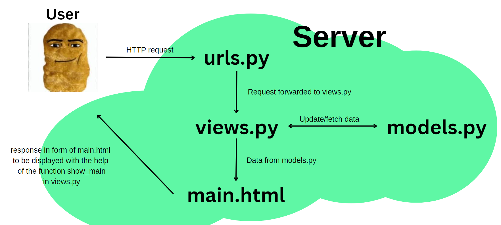
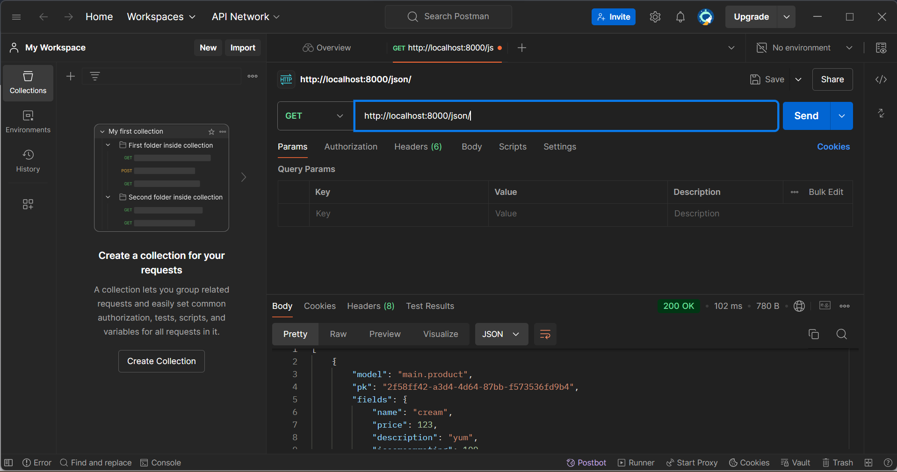
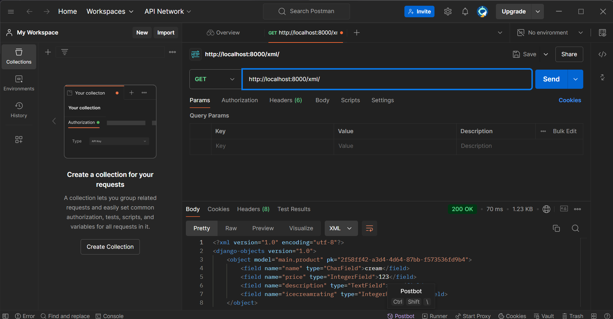
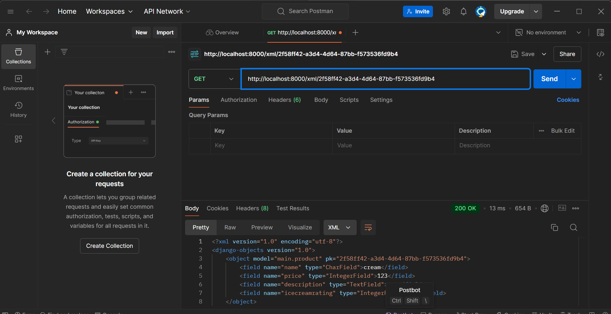
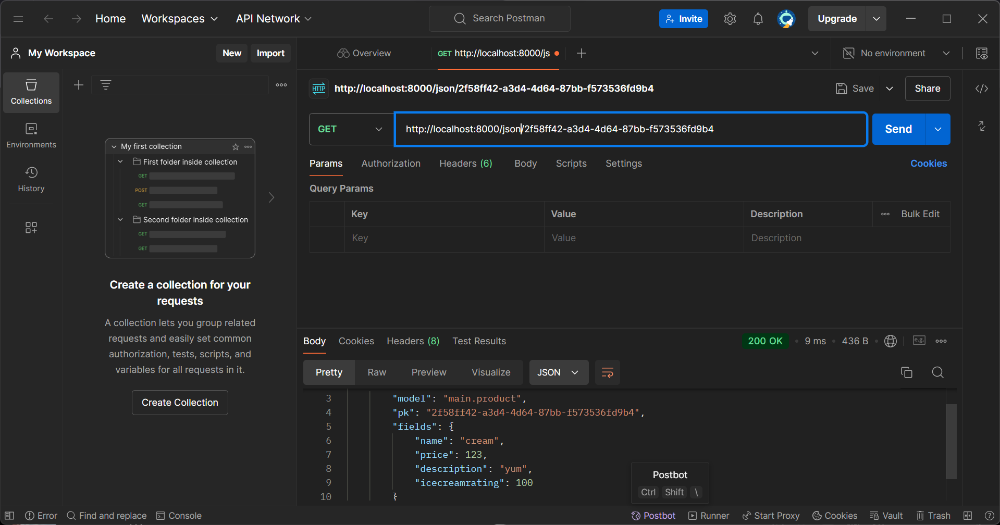

# Platform untuk Mata Kuliah PBP

LINK DEPLOYMENT:
http://andharu-hanif-bingchillingshop.pbp.cs.ui.ac.id/

# TUGAS 2

## Langkah Implementasi (Tugas 2):

1. Buat direktori lokal untuk proyek django dan inisiasi git di dalam direktori tersebut.

2. Buat dan aktifkan virtual environment dengan perintah:

```
python -m venv env
env/Scripts/activate
```

3. Di dalam direktori yang sama, buat berkas requirements.txt dengan isi dependencies:

```
django
gunicorn
whitenoise
psycopg2-binary
requests
urllib3
```

4. Instalasi dependencies dengan perintah:

```

pip install -r requirements.txt

```

5. Inisiasi proyek django dengan perintah:

```

django-admin startproject <nama_proyek> .

```

6. Dalam bagian ALLOWED_HOSTS file settings.py, tambahkan string "localhost" dan "127.0.0.1"

7. Tambah berkas .gitignore dengan isi berkas yang dibutuhkan.
8. Buat direktori main untuk aplikasi main dengan perintah:

```

py manage.py startapp main

```

9. Untuk routing, pertama, tambahkan 'main' di INSTALLED_APPS pada settings.py:

```
INSTALLED_APPS = [
    ...,
    'main',
]
```

10. Lalu, buat berkas urls.py di dalam direktori main.

11. Isi urls.py adalah:

```
from django.urls import path
from main.views import show_main

app_name = 'main'

urlpatterns = [
    path('', show_main, name='show_main'),
]
```

12. Di file models.py pada direktori main, saya buat class product, dengan kode sebagai berikut:

```
class Product(models.Model):
    name = models.CharField(max_length=100)
    price = models.IntegerField()
    description = models.TextField()
    icecreamrating = models.IntegerField()
```

13. Setelah membuat product, saya ingin meletakkan product di file main.html yang nanti akan ditampilkan. Pada views.py, saya membuat fungsi show_main untuk mengembalikan template htmlnya. Kodenya sebagai berikut:

```
def show_main(request):
    products = Product.objects.all()
    context = {
        'products': products,
    }

    return render(request, "main.html", context)
```

14. Untuk memetakan fungsi yang dibuat pada views.py, buka urls.py yang di direktori proyek, tambahkan rute URL main dalam urlpatterns:

```
urlpatterns = [
    ...
    path('', include('main.urls')),
    ...
]
```

15. Akhirnya, saya deploy ke PWS dengan pertama setup remote origin ke link deployment PWS saya, lalu dilakukan push ke origin pws main. Setelah itu, saya buat file README.md ini.

## Bagan Request Client ke Web Aplikasi Django



## Fungsi Git dalam Pengembangan Perangkat Lunak

Fungsi utama Git adalah sebagai version control. Git memungkinkan pengelolaan kode dan versi, serta kolaborasi. Dengan kegunaan tersebut, perubahan kode dapat dilacak dan dengan adanya pencabangan versi proyek, pengelolaan versi kode menjadi lebih mudah, dan kolaborasi dapat dilakukan dengan mengerjakan cabang versi masing-masing tanpa merusak mengubah orang di cabang lainnya. Sehingga Git merupakan alat yang sangat penting dalam pengembangan perangkat lunak.

## Mengapa Django dijadikan Permulaan Pembelajaran Pengembangan Perangkat Lunak?

Saya rasa karena Django termasuk framework fullstack dan juga server-side, kita dapat menyentuh semua sisi pengembangan aplikasi. Mulai dari penanganan interaktivitas sisi klien, hingga interaksi dengan database. Oleh karena itu, menurut saya pembelajaran dengan Django menyeluruh dan membantu membangun fundamental pengembangan aplikasi bagi pembelajarnya.

## Mengapa Model pada Django disebut ORM

Object Relational Mapping (ORM): Sebuah teknik yang digunakan dalam pemrograman untuk menggunakan basisdata relasional sebagai penyimpanan data dengan bentuk objek.
Model pada Django disebut ORM karena Django menggunakan teknik ORM untuk menghubungkan antara objek Python dan basis data relasional.

# TUGAS 3

### Mengapa diperlukan data delivery dalam pengimplementasian sebuah platform

Data delivery diperlukan untuk memastikan informasi atau data dapat dikirim dan diakses dengan efektif antarkomponen dalam sistem atau oleh pengguna.

### XML or JSON?

JSON dikenal lebih populer daripada XML. Mengapa? Sudah diketahui secara luas bahwa JSON memang lebih sederhana dan mudah untuk dibaca, dengan penggunaan key-value pair pada JSON dibandingkan beginning dan end tags pada XML yang lebih kompleks.

### Fungsi is_valid() pada form Django, mengapa dibutuhkan?

Fungsi is_valid() pada form dibutuhkan untuk memvalidasi isi input dari form tersebut.

### Mengapa dibutuhkan csrf_token untuk form

crsf_token berfungsi sebagai lapisan keamanan untuk mencegah serangan. Jika tidak ada csrf_token pada form Django, aplikasinya akan menjadi vulnerable terhadap serangan CSRF. Serangan CSRF (Cross Site Request Forgery) adalah di mana penyerang mengirimkan permintaan tidak sah ke aplikasi atas nama pengguna yang sah tanpa sepengetahuan mereka. Hal itu dapat memungkinkan data pengguna dimanipulasi, account hijacking, dan berbagai dampak buruk lainnya.

## Langkah Implementasi (Tugas 3):

1. Dengan direktori yang tersedia dari tugas sebelumnya, kita lanjut dengan membuat form input data untuk memungkinkan penambahan es krim baru.

Untuk forms, buat file forms.py dalam direktori main, dan tambahkan kode

```
from django.forms import ModelForm
from main.models import Product

class IceCreamEntryForm(ModelForm):
    class Meta:
        model = Product
        fields = ["name", "price", "description", "icecreamrating"]
```

Dapat dilihat bahwa Product yaitu es krim kita assign ke variabel model, dengan fields berisi atribut-atribut yang sesuai.

Lalu pada views.py kita perlu tambah import redirect dari django.shortcuts.

Masih pada views.py, buat fungsi create_bing_entry yang menerima param request, ini untuk mengambil request user untuk membuat es krim (bing)
baru.

```
def create_bing_entry(request):
    form = IceCreamEntryForm(request.POST or None)

    if form.is_valid() and request.method == "POST":
        form.save()
        return redirect('main:show_main')

    context = {'form': form}
    return render(request, "create_bing_entry.html", context)
```

Masih dalam views.py, ubah fungsi show_main dari tugas sebelumnya menjadi

```
def show_main(request):
    products = Product.objects.all()

    context = {
        'products': products,
    }

    return render(request, "main.html", context)
```

Setelah itu, dalam main/urls.py, tambahkan import fungsi create_bing_entry dari main.views. Dan tambahkan path URL fungsinya ke dalam variabel urlpatterns.

Selanjutnya, buat file create_bing_entry.html pada main/templates. Berikut kodenya:

```
 
<h1>Add New Ice Cream</h1>

<form method="POST">
  
  <table>
    {{ form.as_table }}
    <tr>
      <td></td>
      <td>
        <input type="submit" value="Add Ice Cream" />
      </td>
    </tr>
  </table>
</form>


```

Untuk mendisplay setiap es krim baru yang dibuat dari request user, pada main.html ditambahkan kode berikut:

```

    <p>Belum ada ice cream tersedia.</p>
    
    <div class="product-list">
      
      <div class="product-card">
        <h5>🍦Name</h5>
        <p>{{product.name}}</p>
        <h5>Price</h5>
        <p>{{product.price}} USD</p>
        <h5>Description</h5>
        <p>{{product.description}}</p>
        <h5>Chill Rating</h5>
        <p>{{product.icecreamrating}}/10</p>
        <br />
      </div>
       
    </div>
    <a href="">
      <button>Add Ice Cream</button>
    </a>
    
```

Itulah bagaimana implementasi form untuk menambahkan es krim baru dengan request user.

2.  Sekarang, untuk tiap variant es krim, kita ingin menyimpan tersebut menjadi data dalam suatu format tertentu. Terdapat dua opsi yaitu JSON atau XML.

Pada main/views.py, tambahkan import berikut:

```
from django.http import HttpResponse
from django.core import serializers
```

Buatlah fungsi baru untuk menyimpan hasil query dari seluruh data pada Product.

Berikut fungsi untuk kedua formatnya:

```
# Untuk kedua fungsi JSON dan XML persis sama, cuma perlu refactor nama formatnya saja, pada kode di bawah saya tulis <xml/json>.
def show_<xml/json>(request):
    data = Product.objects.all()
    return HttpResponse(serializers.serialize("<xml/json>", data), content_type="application/<xml/json>")
```

Setelah membuat fungsi show_xml dan show_json, tambahkan import baru pada main/urls.py:

```
from main.views import show_main, create_bing_entry, show_xml, show_json
```

Seperti biasa, tambahkan juga path untuk fungsi show_xml dan show_json pada urlpatterns.

Jika kita mau mengakses data pada json atau xml sesuai id, kita dapat buat fungsi baru pada main/views.py. Sama seperti langkah sebelumnya, kita buat dua fungsi berbeda untuk json dan xml namun isinya sama. Hanya diganti namanya saja. Berikut kode fungsinya:

```
def show_<xml/json>_by_id(request, id):
    data = Product.objects.filter(pk=id)
    return HttpResponse(serializers.serialize("<xml/json>", data), content_type="application/<xml/json>")
```

Seperti biasa, tambahkan import show_xml_by_id dan show_json_by_id pada urls.py:

```
from main.views import show_main, create_bing_entry, show_xml, show_json, show_xml_by_id, show_json_by_id
```

Tambahkan juga path kedua fungsi tersebut dalam urlpatterns.

Untuk melihat product sesuai id, dapat diakses melalui url http://localhost:8000/xml/[id] atau http://localhost:8000/json/[id].

## SCREENSHOTS:






# TUGAS 4

### Perbedaan HttpResponseRedirect() dan redirect()

Pada HttpResponseRedirect, argumen pertama hanya bisa url, jadi digunakan jika kita perlu redirect ke URL tertentu dan tidak memerlukan tambahan lainnya. Sedangkan, redirect juga bisa menerima argumen tambahan untuk redirect ke view dan model.

### Cara kerja penghubungan model Product dan User

Pada model Product, ditambahkan variabel

```
user = models.ForeignKey(User, on_delete=models.CASCADE)
```

Kode tersebut mengasosiasikan product dengan suatu user.
Potongan kode ForeignKey(...) menunjukkan bahwa setiap produk terhubung dengan satu pengguna (one-to-many), dan jika pengguna dihapus, semua produk yang terkait juga akan dihapus.

### Bagaimana Django mengingat pengguna yang telah login, serta kegunaan lain dari cookies dan apakah semua cookies aman digunakan

Dengan menggunakan cookies, Django menyimpan sesi login user yang di cookie pada browser user.
Kegunaan lain cookies include keamanan, autentikasi dan pengelolaan sesi, menyimpan preferensi user. untuk personalization/advertisement pada pengguna, dan analitik aktivitas user.

## Langkah Implementasi (Tugas 4):

1. Membuat Fungsi Login

   Pertama, pada main/views.py, tambahkan import authenticate dan login dari django.contrib.auth. Lalu, tambahkan fungsi login_user untuk mengautentikasi user yang ingin login.

```
def login_user(request):
   if request.method == 'POST':
      form = AuthenticationForm(data=request.POST)

      if form.is_valid():
            user = form.get_user()
            login(request, user)
            return redirect('main:show_main')

   else:
      form = AuthenticationForm(request)
   context = {'form': form}
   return render(request, 'login.html', context)
```

Pada main/templates, tambahkan berkas HTML baru dengan isi sbb:

```



<title>Login</title>



<div class="login">
  <h1>Login</h1>

  <form method="POST" action="">
    
    <table>
      {{ form.as_table }}
      <tr>
        <td></td>
        <td><input class="btn login_btn" type="submit" value="Login" /></td>
      </tr>
    </table>
  </form>

  
  <ul>
    
    <li>{{ message }}</li>
    
  </ul>
   Don't have an account yet?
  <a href="">Register Now</a>
</div>


```

Keluar dari views.py dan masuk ke main/urls.py, tambahkan import login_user dari main.views, jangan lupa juga untuk tambahkan url login_user tersebut ke urlpatterns.

```
urlpatterns = [
   ...
   path('login/', login_user, name='login'),
]
```

2. Membuat fungsi logout

Dalam main/views.py, tambahkan import logout dari django.contrib.auth, lalu tambahkan fungsi logout_user sbb:

```
def logout_user(request):
    logout(request)
    return redirect('main:login')
```

Pada templates/main.html, tambahkan tombol untuk logout di bawh tombol untuk menambah es krim baru.

```
...
<a href="">
  <button>Logout</button>
</a>
...
```

Seperti biasa, tambahkan fungsi baru tersebut ke main dengan diimport dulu lalu masukkan pathnya ke urlpatterns.

```
urlpatterns = [
   ...
   path('logout/', logout_user, name='logout'),
]
```

3. Merestriksi Akses Halaman Main

Pada main/views.py, tambahkan import login_required sbb:

```
from django.contrib.auth.decorators import login_required
```

Setelah langkah ini, pada server lokal, seharusnya sekarang user diredirect ke halaman login daripada langsung melihat daftar es krim.

4. Menggunakan Data dari Cookies

Pada main/views.py, tambahkan import:

```
import datetime
from django.http import HttpResponseRedirect
from django.urls import reverse
```

Lalu, pada fungsi login_user, tambahkan cookie berupa last_login untuk mengetahui kapan terakhir user melakukan login. Pada block if form.is_valid() tambahan kode berikut:

```
...
if form.is_valid():
    user = form.get_user()
    login(request, user)
    response = HttpResponseRedirect(reverse("main:show_main"))
    response.set_cookie('last_login', str(datetime.datetime.now()))
    return response
...
```

Setelah itu, pada context fungsi show_main, tambahkan variabel baru 'last_login' dengan mengambil informasi cookie last_login sbb:

```
context = {
        'name': request.user.username,
        'classroom': classroom,
        'products': products,
        'last_login': request.COOKIES['last_login'],
    }
```

Pada logout_user, kita ubah juga kodenya menjadi berikut:

```
def logout_user(request):
    logout(request)
    response = HttpResponseRedirect(reverse('main:login'))
    response.delete_cookie('last_login')
    return response
```

response.delete_cookie('last_login') berfungsi untuk menghaups cookie last_login saat pengguna melakukan logout.

Kemudian, buka templates/main.html dan tambahkan kode berikut di bawah tombol logout:

```
...
<h5>Sesi terakhir login: {{ last_login }}</h5>
...
```

5.  Menghubungkan products dengan user secara unik

Buka main/models.py dan tambahkan import user dari django.contrib.auth.models.

Pada model Product yang sudah ada, tambahkan variabel user dengan isinya:

```
class MoodEntry(models.Model):
   user = models.ForeignKey(User, on_delete=models.CASCADE)
   ...
```

Penjelasan untuk kode di atas ada pada persoalan pertama tugas ini.

Lalu, buka main/views.py dan ubah kode fungsi create_bing_entry menjadi sbb:

```
form = IceCreamEntryForm(request.POST or None)

    if form.is_valid() and request.method == "POST":
        product = form.save(commit=False)
        product.user = request.user
        product.save()
        return redirect('main:show_main')

    context = {'form': form}
    return render(request, "create_bing_entry.html", context)
```

Setelah itu, ubah value dari product pada fungsi show_main menjadi berikut:

```
def show_main(request):
    mood_entries = MoodEntry.objects.filter(user=request.user)
    context = {
         'name': request.user.username,
         ...
    }
```

Hal ini agar objek product/es krim yang ditampilkan terasosiasikan dengan pengguna yang sedang login.

Value 'name' diganti menjadi request.user.username untuk menampilkan data nama sesuai username pengguna yang sedang login.

Simpan semua perubahan dan lakukan makemigrations. Saat membuat migrasi model, akan muncul error (ini harus terjadi), ketik angka 1 dan enter, lakukan ini dua kali (karena promptnya ada 2).

Setelah sukses, lakukan migrate.

Langkah terakhir, tambahkan import baru pada settings.py yaitu import os, dan ganti variabel DEBUG dari berkas settings.py menjadi:

```
PRODUCTION = os.getenv("PRODUCTION", False)
DEBUG = not PRODUCTION
```

# TUGAS 5

### Prioritas Selector CSS

Element Selector -> Class Selector -> ID Selector -> Inline CSS

### Responsive Design

Responsive design pada sebuah aplikasi penting untuk aksesibilitas dari macam-macam device dengan kemungkinan ukuran layar dan behavior yang berbeda. Contoh yang sudah menerapkan responsive design adalah website GOTO, contoh yang belum responsive adalah Pacil Web Service.

### Beda Margin, Border, dan Padding

Margin: Space disekitar border elemen
Paddding: Space antara border dan konten elemen
Border: Bagian pinggir suatu box elemen

### Flex Box dan Grid Layout

Flex box: Dibuat untuk layout one-dimensional, jadi dia berfungsi pada suatu row atau kolom. Flex box penting untuk bentuk layout yang responsif serta align/distribute items dalam suatu container.

Grid layout: Dibuat untuk layout two-dimensional, sehingga item bisa diposisikan pada kolom atau row. Digunakan untuk bentuk layout yang lebih kompleks.

## Langkah Implementasi (Tugas 5):

1. Menambahkan Tailwind ke Aplikasi
   Pada base.html, tambahkan tag <meta name="viewport"> agar halaman web dapat menyesuaikan ukuran dan perilaku perangkat mobile. Lalu, untuk menyambungkan aplikasi django dengan tailwind, gunakan script content delivery network untuk diletakkan di dalam html template django. Hasil kodenya sbb:

```
<head>

    <meta charset="UTF-8" />
    <meta name="viewport" content="width=device-width, initial-scale=1">

<script src="https://cdn.tailwindcss.com">
</script>
</head>
```

2. Menambahkan Fitur Edit Product pada Aplikasi
   Pada main/views.py, buat fungsi baru edit_product sbb:

```
def edit_bing(request, id):
    ice_cream = Product.objects.get(pk = id)

    form = IceCreamEntryForm(request.POST or None, instance=ice_cream)

    if form.is_valid() and request.method == "POST":
        form.save()
        return HttpResponseRedirect(reverse('main:show_main'))

    context = {'form': form}
    return render(request, "edit_bing.html", context)
```

Masih di file yang sama, tambahkan juga import berikut:
from django.shortcuts import .., reverse
from django.http import .., HttpResponseRedirect

Lalu buat file baru edit_bing.html pada main/templates. Isinya adalah sbb:

```






<h1>Edit Ice Cream</h1>

<form method="POST">
    
    <table>
        {{ form.as_table }}
        <tr>
            <td></td>
            <td>
                <input type="submit" value="Edit Ice Cream"/>
            </td>
        </tr>
    </table>
</form>


```

Seperti biasa, buka main/urls.py dan import edit_bing dari main.views. Tambahkan juga pathnya sbb:

```
...
path('edit-mood/<uuid:id>', edit_mood, name='edit_mood'),
...
```

Setelah itu, pada main/templates/main.html, tambahkan:

```
 <a href="">
            <button>
                Edit
            </button>
        </a>
```

pada akhir div untuk product-card untuk menambahkan tombol edit pada setiap card.

3. Menambahan Fitur Hapus Produk dalam Aplikasi

Buat fungsi baru delete_bing pada views.py dengan kode sbb:

```
def delete_bing(request, id):
    product = MoodEntry.objects.get(pk = id)
    product.delete()
    return HttpResponseRedirect(reverse('main:show_main'))
```

Jangan lupa juga untuk import fungsinya di urls.py, dan tambahkan urlnya di urlpatterns:

```
...
path('delete/<uuid:id>', delete_mood, name='delete_mood'), # sesuaikan dengan nama fungsi yang dibuat
...
```

4. Buka main.html dan ubah kodenya menjadi:

```
<div class="product-card">
        <h5>🍦Name</h5>
        <p>{{product.name}}</p>
        <h5>Price</h5>
        <p>{{product.price}} USD</p>
        <h5>Description</h5>
        <p>{{product.description}}</p>
        <h5>Chill Rating</h5>
        <p>{{product.icecreamrating}}/10</p>
        <a href="">
          <button class="button">Edit</button>
        </a>
        <a href="">
          <button class="button">Delete</button>
        </a>
        <br />
      </div>
```

5. Menambahkan Navigation Bar pada Aplikasi

Buat navbar.html pada templates, lalu tambahkan kode berikut:

```
 
<nav class="bg-[#62a144] p-4 w-full shadow">
  <div class="container mx-auto flex justify-between items-center">
    <div class="text-white font-bold text-xl">Bing Chilling</div>
    <div>
      <a
        href=""
        class="bg-white text-[#62a144] font-semibold py-2 px-4 rounded hover:bg-[#4e8435]"
      >
        Logout
      </a>
    </div>
  </div>
</nav>

```

Untuk menambahkan navigation bar pada main.html, create_bing_entry, dan edit_bing, gunakan tag include '...' :

```



...

```

6. Konfigurasi Static FIles pada Aplikasi

Pada settings.py, tambahkan middleware WhiteNoise:

```
...
MIDDLEWARE = [
    'django.middleware.security.SecurityMiddleware',
    'whitenoise.middleware.WhiteNoiseMiddleware', #Tambahkan tepat di bawah SecurityMiddleware
    ...
]
...
```

tambahkan juga...

```
...
STATIC_URL = '/static/'
if DEBUG:
    STATICFILES_DIRS = [
        BASE_DIR / 'static' # merujuk ke /static root project pada mode development
    ]
else:
    STATIC_ROOT = BASE_DIR / 'static' # merujuk ke /static root project pada mode production
...
```

Sekarang, karena sudah menambahkan tailwind, tinggal tambahkan stylingnya ke masing-masing template. Berikut kode-kodenya untuk template-template yang ada:

#### create_bing_entry.html

```




<h1 class="text-3xl font-bold mb-6 text-center text-green-600">Add New Ice Cream</h1>

<form method="POST" class="max-w-lg mx-auto p-4 bg-white shadow-lg rounded-lg relative">
  <a href="" class="absolute top-2 right-2 bg-red-500 text-white w-8 h-8 flex items-center justify-center hover:bg-red-600 transition duration-300" title="Go back">
    X
  </a>

  
  <div class="space-y-4">
    {{ form.as_p }}
    <div>
      <input
        type="submit"
        value="Add Ice Cream"
        class="w-full bg-green-600 text-white rounded-md py-2 border border-black hover:bg-green-700 transition duration-300"
      />
    </div>
  </div>
</form>



#### edit_bing_entry.html
  

<h1 class="text-3xl font-bold mb-6 text-center text-green-600">
  Add New Ice Cream
</h1>

<form
  method="POST"
  class="max-w-lg mx-auto p-4 bg-white shadow-lg rounded-lg relative"
>
  <a
    href=""
    class="absolute top-4 right-4 bg-red-500 text-white w-8 h-8 flex items-center justify-center hover:bg-red-600 transition duration-300"
    title="Go back"
  >
    X
  </a>

  
  <div class="space-y-4">
    {{ form.as_p }}
    <div>
      <input
        type="submit"
        value="Add Ice Cream"
        class="w-full bg-green-600 text-white rounded-md py-2 border border-black hover:bg-green-700 transition duration-300"
      />
    </div>
  </div>
</form>
```



#### edit_bing.html

```
  

<h1 class="text-3xl font-bold mb-6 text-center text-green-600">
  Add New Ice Cream
</h1>

<form
  method="POST"
  class="max-w-lg mx-auto p-4 bg-white shadow-lg rounded-lg relative"
>
  <a
    href=""
    class="absolute top-4 right-4 bg-red-500 text-white w-8 h-8 flex items-center justify-center hover:bg-red-600 transition duration-300"
    title="Go back"
  >
    X
  </a>

  
  <div class="space-y-4">
    {{ form.as_p }}
    <div>
      <input
        type="submit"
        value="Add Ice Cream"
        class="w-full bg-green-600 text-white rounded-md py-2 border border-black hover:bg-green-700 transition duration-300"
      />
    </div>
  </div>
</form>



```

#### main.html

(Untuk main.html, digunakan css stylesheet internal)

```
<!DOCTYPE html>
<html lang="en">
  
  <head>
    <meta charset="UTF-8" />
    <meta name="viewport" content="width=device-width, initial-scale=1.0" />
    <title>Bing Chilling Shop</title>
    <style type="text/css">
      body {
        font-family: "Arial", sans-serif;
        background-color: #f4f4f9;
        margin: 0;
        padding: 0;
        display: flex;
        flex-direction: column;
        align-items: center;
      }

      h1 {
        margin: 40px;
        font-size: 2.5rem;
      }

      .product-list {
        display: flex;
        flex-wrap: wrap;
        justify-content: center;
        gap: 30px;
        max-width: 1200px;
      }

      .product-card {
        background-color: #ffcfe8;
        border-radius: 10px;
        padding: 20px;
        width: 200px;
        height: 350px;
        display: flex;
        flex-direction: column;
        align-items: flex-start;
        text-align: left;
      }

      .product-card img {
        width: 100%;
        height: 200px;
        object-fit: cover;
        border-radius: 8px;
        margin-bottom: 20px;
      }

      .product-card h5 {
        font-size: 1rem;
        margin: 0px 0 5px;
        font-weight: bold;
      }

      .product-card p {
        font-size: 1rem;
        margin: 5px 0;
      }

      .price {
        font-size: 1.5rem;
        font-weight: bold;
        margin-bottom: 10px;
      }

      .rating {
        font-size: 1rem;
      }

      .button {
        background-color: #62a144;
        display: inline;
        cursor: pointer;
        color: white;
        border: none;
        padding: 1px 10px;
        font-size: 12px;
      }
    </style>
  </head>
  <body>
     
    <strong><h1>Bing Chilling Creamery</h1></strong>
    <h2>Selamat datang, {{ request.user.username }}!</h2>
    
    
    <p>Belum ada ice cream tersedia.</p>
    
    <div class="product-list">
      
      <div class="product-card">
        <h5>🍦Name</h5>
        <p>{{product.name}}</p>
        <h5>Price</h5>
        <p>{{product.price}} USD</p>
        <h5>Description</h5>
        <p>{{product.description}}</p>
        <h5>Chill Rating</h5>
        <p>{{product.icecreamrating}}/10</p>
        <a href="">
          <button class="button">Edit</button>
        </a>
        <a href="">
          <button class="button">Delete</button>
        </a>
        <br />
      </div>
       
    </div>
    <a href="">
      <button class="button">Add Ice Cream</button>
    </a>
    <a href="">
      <button class="button">Logout</button>
    </a>
    <h5>Sesi terakhir login: {{ last_login }}</h5>
    
  </body>
</html>
```

# TUGAS 6

### Manfaat JavaScript dalam Pengembangan Aplikasi Web
JavaScript memungkinkan interaktivitas dalam halaman web tersebut untuk pengguna, serta pengolahan data asinkronus.

### Guna await Ketika Menggunakan fetch()
await digunakan untuk menunggug hasil dari operasi fetch tersebut sebelum lanjut ke bagian kode selanjutnya. Jika tidak menggunakan await, kode berikutnya akan dieksekusi sebelum permintaan fetch() selesai sehingga hasil dari fetch() tidak ditangkap dan datanya tidak tersedia.

### Mengapa Perlu Menggunakan Decorator untuk crsf_exempt
Untuk melindungi dari serangan CSRF dengan memeriksa token CSRF pada setiap permintaan POST. 

### Mengapa Pembersihan Data Input Pengguna Tidak Dilakukan di Frontend Saja?
Karena di frontend lebih rentan terhadap manipulasi oleh user. Pembersihan data input dilakukan di backend untuk memastikan keamanan.

## Langkah Implementasi Tugas 6

1. Menambahkan Error Message Pada Login
Berikan conditional tambahan pada form.is_valid() main/views.py:
```
...
if form.is_valid():
    user = form.get_user()
    login(request, user)
    response = HttpResponseRedirect(reverse("main:show_main"))
    response.set_cookie('last_login', str(datetime.datetime.now()))
    return response
else:
    messages.error(request, "Invalid username or password. Please try again.")
...
```

2. Membuat Fungsi untuk Menambah Product dengan AJAX
Pertama, tambahkan dua import pada views.py
```
from django.views.decorators.csrf import csrf_exempt
from django.views.decorators.http import require_POST
```

Lalu buat fungsi tersebut untuk menambahkan product dengan AJAX:
```
@csrf_exempt
@require_POST
def add_bing_entry_ajax(request):
    id = request.POST.get("id")
    name = request.POST.get("name")
    price = request.POST.get("price")
    description = request.POST.get("description")
    icecreamrating = request.POST.get("icecreamrating")
    user = request.user

    new_bing = Product(
        id = id, name = name, price = price, description = description, icecreamrating = icecreamrating, user=user)
    new_bing.save()

    return HttpResponse(b"CREATED", status=201)
```

Jangan lupa juga dirouting fungsi add_mood_entry_ajax tersebut:
```
from main.views import ..., add_mood_entry_ajax
```
```
urlpatterns = [
    ...
      path('create-bing-entry-ajax', add_bing_entry_ajax, name='add_bing_entry_ajax'),
]
```


3. Menambahkan Data Mood Entry dengan fetch() API
Pada main/views.py hapus kode tersebut:
```
  products = Product.objects.filter(user=request.user)
```

```
products = products
```

Pada views.py masih, ubah baris pertama show_json dan show_xml sbb:
```
data = Product.objects.filter(user=request.user)
```

Lalu, pada main.html, hapus block conditional product yang untuk menampilkan products. Dan ganti dengan block
```
    <div id="bing_entry_cards"></div>
```

Tambahkan block script di bawah sebelum endblock: 
```
async function getBingEntries(){
          return fetch("").then((res) => res.json())
      }
```

Tambahkanjuga fungsi baru dengan nama refreshBingEntries:
```
async function refreshBingEntries() {
        document.getElementById("bing_entry_cards").innerHTML = "";
        document.getElementById("bing_entry_cards").className = "";
        const bingEntries = await getBingEntries();
        let htmlString = "";
        let classNameString = "";

        if (bingEntries.length === 0) {
            classNameString = "flex flex-col items-center justify-center min-h-[24rem] p-6";
            htmlString = `
                <div class="flex flex-col items-center justify-center min-h-[24rem] p-6">
                    
                    <p class="text-center text-gray-600 mt-4">Belum ada es krim...</p>
                </div>
            `;
        }
        else {
            classNameString = "flex flex-wrap justify-center gap-8 max-w-[1200px]"
            bingEntries.forEach((item) => {
                const fields = item.fields;
                htmlString += `
                <div class="product-card">
                  <h5>🍦Name</h5>
                  <p>${fields.name}</p>
                  <h5>Price</h5>
                  <p>${fields.price} USD</p>
                  <h5>Description</h5>
                  <p>${fields.description}</p>
                  <h5>Chill Rating</h5>
                  <p>${fields.icecreamrating}/10</p>
                  <a href="/edit-bing/${item.pk}">
                    <button class="button">Edit</button>
                  </a>
                  <a href="/delete/${item.pk}">
                    <button class="button">Delete</button>
                  </a>
                  <br />
                </div>
                `;
            });
        }
        document.getElementById("bing_entry_cards").className = classNameString;
        document.getElementById("bing_entry_cards").innerHTML = htmlString;
    }
```

3. Membuat Modal Sebagai Form untuk Menambahkan Mood

Kode modalnya sbb(letakkan di bawah div bing_entry_cards):
```
<div
      id="addIceCreamModal"
      class="fixed z-10 inset-0 overflow-y-auto hidden"
      aria-labelledby="modal-title"
      role="dialog"
      aria-modal="true"
    >
      <div class="flex items-center justify-center min-h-screen">
        <div class="fixed inset-0 bg-gray-500 bg-opacity-75 transition-opacity"></div>
        <div
          class="bg-white rounded-lg text-left overflow-hidden shadow-xl transform transition-all sm:max-w-lg sm:w-full"
        >
          <div class="bg-white px-4 pt-5 pb-4 sm:p-6 sm:pb-4">
            <div class="sm:flex sm:items-start">
              <div class="mt-3 text-center sm:mt-0 sm:ml-4 sm:text-left">
                <h3 class="text-lg leading-6 font-medium text-gray-900" id="modal-title">
                  Add New Ice Cream
                </h3>
                <div class="mt-2">
                  <form id="addIceCreamForm" method="POST" action="">
                    
                    <div class="mt-2">
                      <label for="name" class="block text-sm font-medium text-gray-700">Ice Cream Name</label>
                      <input
                        type="text"
                        name="name"
                        id="name"
                        class="mt-1 focus:ring-indigo-500 focus:border-indigo-500 block w-full shadow-sm sm:text-sm border-gray-300 rounded-md"
                        required
                      />
                    </div>
                    <div class="mt-2">
                      <label for="price" class="block text-sm font-medium text-gray-700">Price (USD)</label>
                      <input
                        type="number"
                        name="price"
                        id="price"
                        class="mt-1 focus:ring-indigo-500 focus:border-indigo-500 block w-full shadow-sm sm:text-sm border-gray-300 rounded-md"
                        required
                      />
                    </div>
                    <div class="mt-2">
                      <label for="description" class="block text-sm font-medium text-gray-700">Description</label>
                      <textarea
                        name="description"
                        id="description"
                        class="mt-1 focus:ring-indigo-500 focus:border-indigo-500 block w-full shadow-sm sm:text-sm border-gray-300 rounded-md"
                        required
                      ></textarea>
                    </div>
                    <div class="mt-2">
                      <label for="icecreamrating" class="block text-sm font-medium text-gray-700">Chill Rating (1-10)</label>
                      <input
                        type="number"
                        name="icecreamrating"
                        id="icecreamrating"
                        min="1"
                        max="10"
                        class="mt-1 focus:ring-indigo-500 focus:border-indigo-500 block w-full shadow-sm sm:text-sm border-gray-300 rounded-md"
                        required
                      />
                    </div>
                  </form>
                </div>
              </div>
            </div>
          </div>
    
          <div class="bg-gray-50 px-4 py-3 sm:px-6 sm:flex sm:flex-row-reverse">
            <button
              type="submit"
              form="addIceCreamForm"
              class="w-full inline-flex justify-center rounded-md border border-transparent shadow-sm px-4 py-2 bg-[#62a144] text-base font-medium text-white hover:bg-green-700 sm:ml-3 sm:w-auto sm:text-sm"
            >
              Save
            </button>
            <button
              type="button"
              class="mt-3 w-full inline-flex justify-center rounded-md border border-gray-300 shadow-sm px-4 py-2 bg-white text-base font-medium text-gray-700 hover:bg-gray-50 sm:mt-0 sm:w-auto sm:text-sm"
              onclick="hideModal()"
            >
              Cancel
            </button>
          </div>
        </div>
      </div>
    </div>
```

Agar bisa menunjukkan dan menghilangkan modal tersebut, tambahkan:
```
    function showModal() {
      document.getElementById('addIceCreamModal').classList.remove('hidden');
      setTimeout(() => {
        modalContent.classList.remove('opacity-0', 'scale-95');
        modalContent.classList.add('opacity-100', 'scale-100');
      }, 50); 
    }

    function hideModal() {
      document.getElementById('addIceCreamModal').classList.add('hidden');
      setTimeout(() => {
        modal.classList.add('hidden');
      }, 150); 
    }
```

4. Menambahkan Data Mood dengan AJAX

Tambahkan kode berikut (sudah termasuk event listener):
```
document.getElementById("addIceCreamForm").addEventListener("submit", async function(event) {
      event.preventDefault(); 

      const response = await fetch("", {
        method: "POST",
        body: new FormData(document.querySelector('#addIceCreamForm')),
      });

      if (response.ok) {
            await refreshBingEntries(); 
            document.getElementById("addIceCreamForm").reset();
            hideModal(); 
        } else {
            console.error("Gagal menambahkan es krim :()", response.statusText);
        }
    })
```


